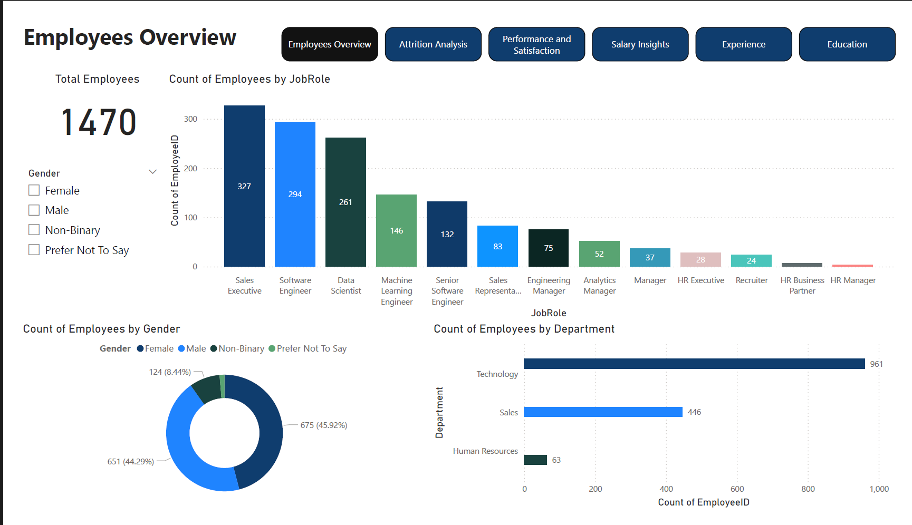

# HR Analytics Dashboard

This project is a comprehensive HR Analytics project built using SQL and Power BI. It analyzes employee data to uncover key insights related to attrition, performance, satisfaction, salary information, and experience.

## Key Features

- **Employee Overview:** Gender, Department, Job Role breakdowns
- **Attrition Analysis:** Attrition rates across departments, genders, and job roles
- **Performance & Satisfaction:** Relationship between ratings, satisfaction, and job role
- **Salary Insights:** Income distribution, trends by role and department
- **Experience:** Average tenure and experience visualized across roles
- **Education & Training:** Impact of education and training hours

## Tools & Technologies

- **SQL Server Management Studio (SSMS)** – Data exploration and transformation
- **Power BI** – Interactive visual dashboard creation
- **Microsoft Excel / CSV** – Data storage and manipulation

## Dashboard Preview

## Dataset

The dataset used in this project is available [on Kaggle](https://www.kaggle.com/datasets/mahmoudemadabdallah/hr-analytics-employee-attrition-and-performance).
